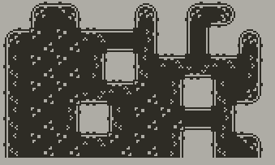
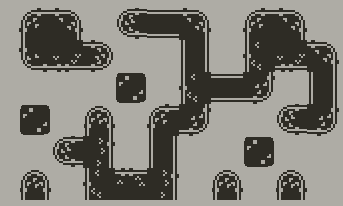

# Playdate-Autotile
A simple autotile helper class for the Playdate, written in Lua

Tiles modified from kenney.nl's [1-Bit Pack](https://www.kenney.nl/assets/bit-pack)





Demo app available in [releases](https://github.com/GammaGames/Playdate-Autotile/releases)

```lua
import "autotile"

local function initialize()
    local at = Autotile("monochrome-tilemap", width, height)
    at:moveTo(200, 120)

    math.randomseed(0)

    -- Generate some noise
    local noises = gfx.perlinArray(
        at.columns * at.rows,
        math.random(), 1,
        math.random(), 1,
        0, 0,
        0,
        1,
        0.5
    )
    -- Set each cell to SOLID or EMPTY
    at:setCallback(
        noises, at.columns,
        function(val)
            if val > 0.5 then
                return STATE.SOLID
            else
                return STATE.EMPTY
            end
        end
    )
end

initialize()
```
